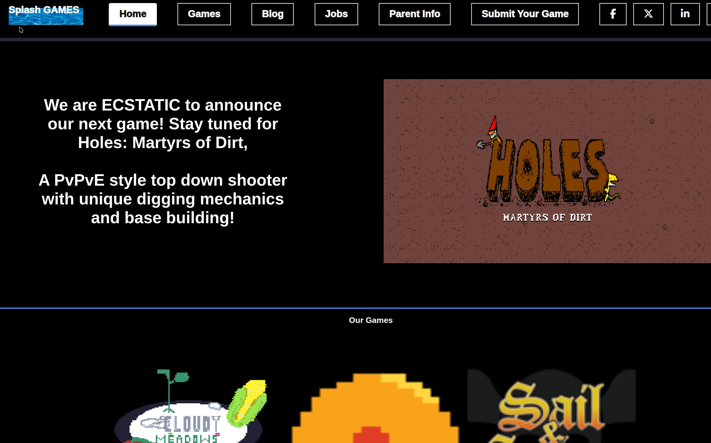

# [Splash Games 🌊🎮](https://davidkozdra.github.io/splashGames/ )

Welcome to **Splash Games** — a clean, modern website project built to showcase games, blogs, and career opportunities for a fictional game studio.  
This site is built with pure **HTML**, **CSS** (custom properties/variables), and a touch of **JavaScript** for simple animations and interactive elements.

This project was designed as a personal challenge to sharpen front-end development skills, with an emphasis on **layout**, **styling**, and **responsive design principles**.

---

## 🌟 Project Goals

- Improve CSS layout and design techniques.
- Practice clean HTML5 structure with semantic tags.
- Implement simple JavaScript-driven interactions.
- Focus on typography, spacing, and visual consistency across multiple pages.

---

## 🖼️ Preview

---

## 📋 Requirements Met

- ✅ Six-page site with clear and consistent navigation.
- ✅ Use of **at least one** ordered list or unordered list.
- ✅ Proper use of **heading tags** (`<h1>`, `<h2>`, etc.) in body content.
- ✅ Inclusion of **at least four images** (not background images).
- ✅ Body text is actual written content — no filler text like Lorem Ipsum.
- ✅ External CSS file used across all pages (no inline or embedded styles).
- ✅ Well-defined, easy-to-use navigation menu.
- ✅ One properly coded **email link** (`mailto:`).
- ✅ One properly coded **external link** opening in a new tab.
- ✅ Use of at least **three special HTML characters** (e.g., ©, ®, ™).

---

---

## 🛠️ Technologies Used

- HTML5
- CSS3 (Custom Properties / Variables)
- FontAwesome for icons
- Basic JavaScript (Animations on first page load)

---

## 📝 Author

Designed and developed by **[David Kozdra](https://davidkozdra.com/)**.

---

